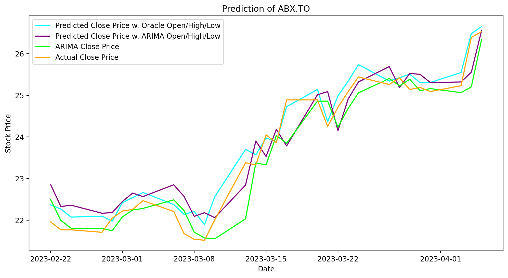

    
    

# stock-price-prediction

An attempt to predict stock price

**DISCLAIMER**: This repo is for educational purpose. Please don't take the results as financial advices.

## Environment

- Python 3.7
- Windows 10

## Install

Create a virtual environment.

    python -m venv venv
    .\venv\Scripts\activate

Next go to [https://pytorch.org/get-started/locally/](https://pytorch.org/get-started/locally/) and install PyTorch. For example, if you don't have CUDA,

    pip install torch==1.6.0+cpu torchvision==0.7.0+cpu -f https://download.pytorch.org/whl/torch_stable.html

Then install dependencies.

    pip install -r .\requirements.txt

> Use `pip install -r requirements-dev.txt` for development.
> It will install `pylint`, `black`, and `jupyter` to enable linting, auto-formatting, and notebook experience.

## Usage

Go to [https://www.alphavantage.co/support/#api-key](https://www.alphavantage.co/support/#api-key) and claim your API key.

Create a `.env` file to store your alpha vantage api key and a ticker.

    # .env
    # required
    ALPHA_VANTAGE_API_KEY="xxx"
    TICKER_NAME="yyy"

    # optional and the defaults
    CYC_LEN=20
    SEED=2020
    VALID_PCT=.1
    LAYERS="[200, 100]"

Run the modelling script

    python modelling.py

## Example Results

### Price Action History

### Time Series Analysis

### Predictive Modelling

## Credits

- [Bear Logo][1] and [Bull Logo][2] by [pongsakorn tan][3]

[1]: https://www.iconfinder.com/icons/4591876/animal_bear_carnivore_cartoon_fauna_head_zoo_icon
[2]: https://www.iconfinder.com/icons/4591900/animal_buffalo_cape_cartoon_fauna_herbivore_zoo_icon
[3]: https://www.iconfinder.com/kerismaker
