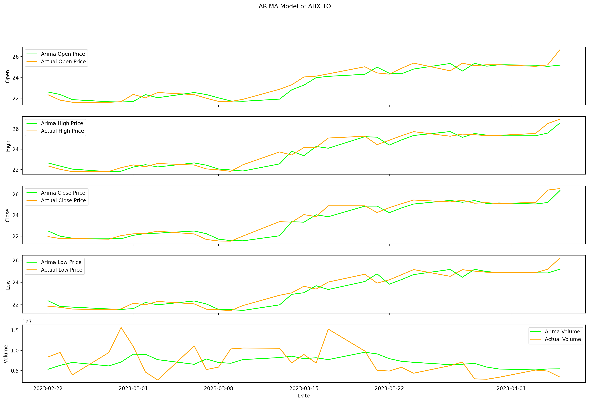

# stock-price-prediction

An attempt to predict stock price

**DISCLAIMER**: This repo is for educational purpose. Please don't take the results as financial advices.

## Environment

- Python 3.9
- Windows 10

## Install

Create a virtual environment.

    python -m venv .venv
    .\.venv\Scripts\activate

Then install dependencies.

    pip install -r .\requirements.txt

> Use `pip install -r requirements-dev.txt` for development.

## Usage

Create a `.env` file to store your ticker name.

    # .env
    # required
    TICKER_NAME="yyy"

    # optional and the defaults
    CYC_LEN=20
    SEED=2020
    VALID_PCT=.1
    LAYERS="[200, 100]"

Run the modelling script

    python modelling.py

## Example Results

### Price Action History

### Time Series Analysis

### Predictive Modelling

